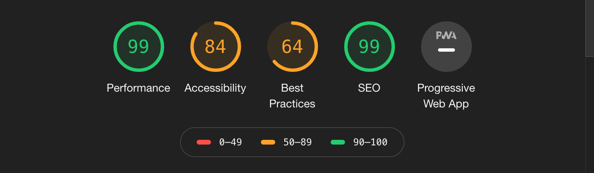
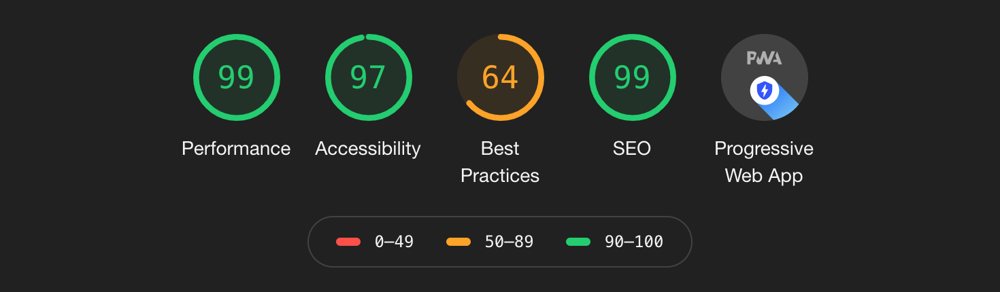

# E-Commerce Website | [Wonderlust](https://wonderlustpwa.herokuapp.com/)
This project is an e-commerce website centered around gold jewelry. It contains three pages routed together through react. The home page has slider images. The product page contains products, pulled from a MongoDB database. The contact page has a form. React and MongoDB is linked together through Express. The website has been modified to become a progressive web app that can be now be downloaded onto mobile devices.
## Getting Started
1. Use `npm install` to install all needed dependencies as listed by the package.json.
2. Run `mongod` to start the MongoDB process and run it in the background.
3. Create a `.env` in both the root directory and the test directory. The `.env` in the test directory should contain a different port for the tests.
4. Use `npm start` to start the application from the root directory.
## Getting Started (Mobile)
1. Open the [link](https://wonderlustpwa.herokuapp.com/) on your mobile device.
2. On Safari, hit the download button on the bottom.
3. Scroll to the right until you see `Add to Home Screen` and tap on it.
4. Wonderlust should now be available on your phone.
## Preview of Application

### App Icon 

### App Home Screen

## Audit

| Pre-Audit       | Post-Audit           | 
| ------------- |:-------------:| 
|       |  | 

### Built With
* [React](https://reactjs.org/docs/getting-started.html) - JavaScript library for building user interfaces
* [Express](https://expressjs.com/) - Server framework for Node.js
* [MongoDB](https://docs.mongodb.com/) - Cross-platform document-oriented database program
## Running the Tests
Use `npm test` from the root directory.
## Author
* [Biridiana Hinojosa](https://github.com/d-hinojosa)
## License
This project is licensed under the MIT License - see the [LICENSE](LICENSE) file for details
